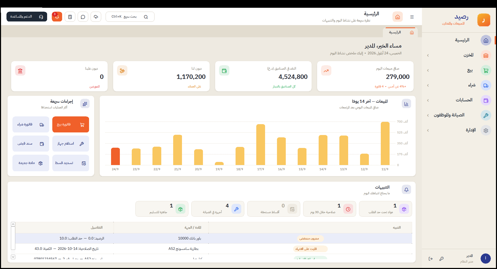
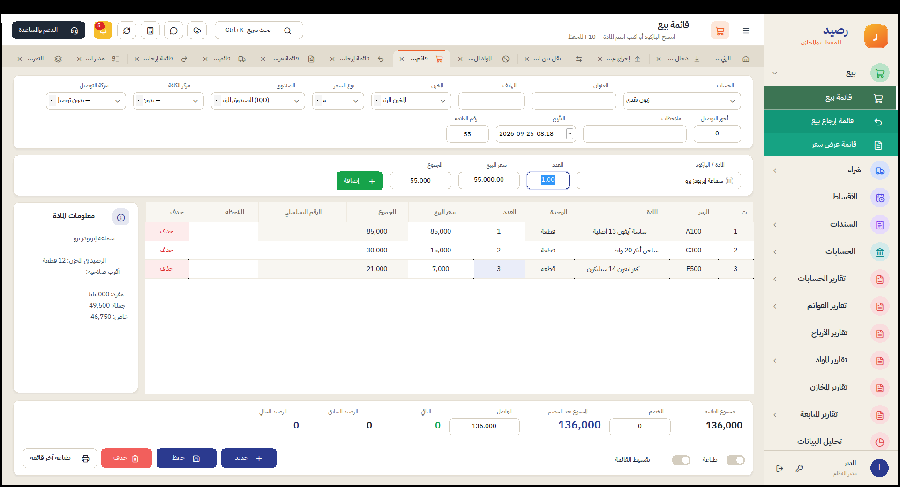
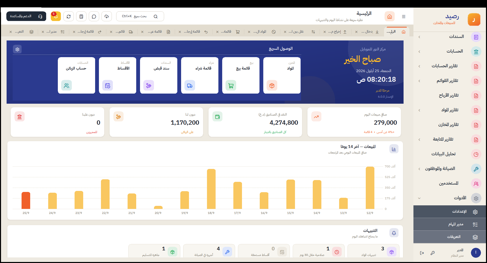
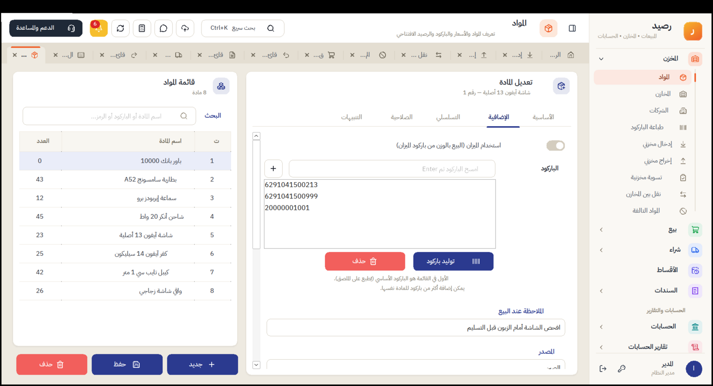
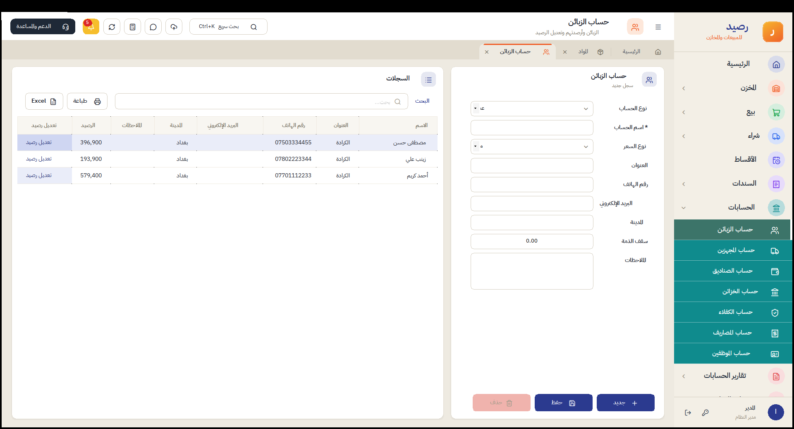
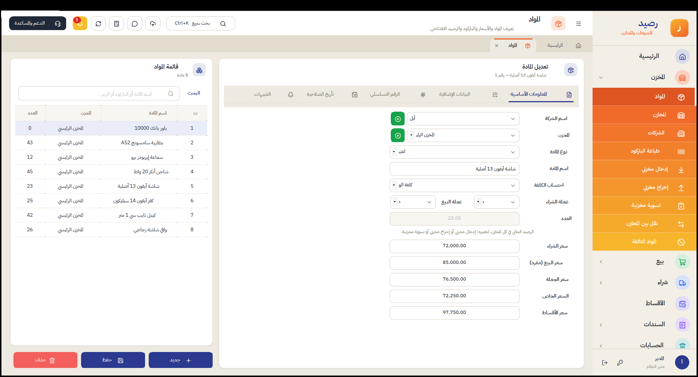
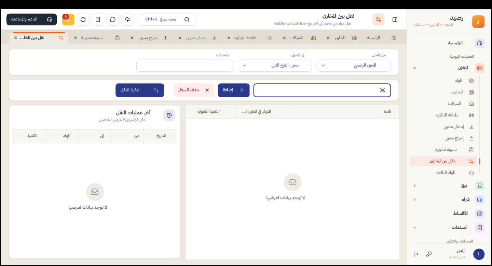
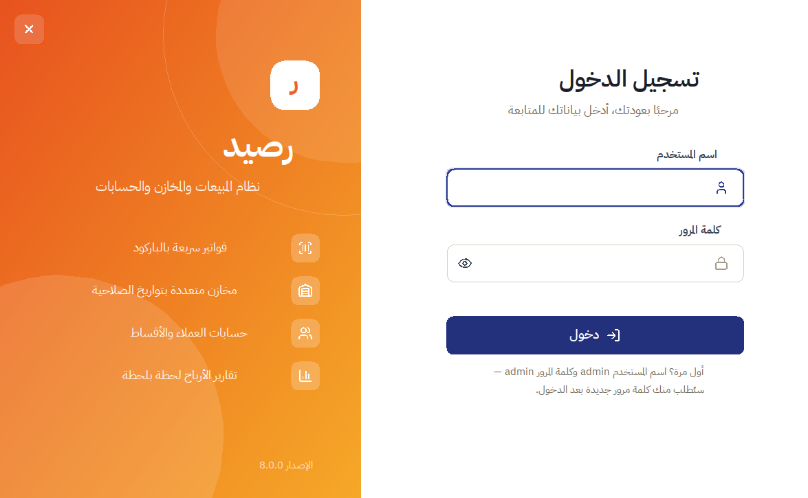
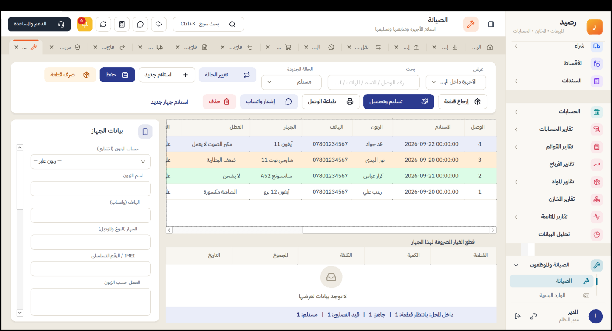

# رصيد — نظام المبيعات والمخازن والحسابات (C# / WinForms)



## التشغيل
1. ثبّت **Visual Studio 2022** (حمولة ".NET desktop development") أو **.NET 8 SDK**.
2. افتح `Raseed.csproj` — سيتم تنزيل حزمة `Microsoft.Data.Sqlite` تلقائياً.
3. شغّل بـ F5، أو من الطرفية:
   ```
   dotnet run
   ```
4. لإخراج نسخة تنفيذية مستقلة لا تحتاج تثبيت .NET:
   ```
   dotnet publish -c Release -r win-x64 --self-contained -p:PublishSingleFile=true
   ```
5. الدخول الأول: **admin / admin** — تظهر بعدها شاشة ترحيب لإدخال بيانات المحل واختيار كلمة مرور جديدة.

قاعدة البيانات ملف واحد: `%LOCALAPPDATA%\Raseed\raseed.db` — وسجل الأخطاء (إن وُجدت) في `errors.log` بجانبها.

الخطوط والأيقونات مضمّنة داخل البرنامج (لا تحتاج تثبيتاً): **IBM Plex Sans Arabic** (رخصة OFL) و**Lucide** (رخصة ISC) — ملفات الرخص في `Assets/`.

## اختصارات لوحة المفاتيح
| الاختصار | الوظيفة |
|---|---|
| `Ctrl+K` | البحث السريع: اكتب اسم أي شاشة وانتقل إليها |
| `Ctrl+W` | إغلاق التبويب الحالي |
| `Ctrl+Tab` | التنقل بين التبويبات المفتوحة |
| `F1` | الدعم والمساعدة |
| `F5` | تحديث الشاشة الحالية بأحدث البيانات |
| `F2` | الانتقال إلى مربع البحث بالباركود في الفاتورة |
| `F3` | البحث في قائمة المواد |
| `F10` | حفظ الفاتورة / المادة / السند |
| `Enter` | إضافة المادة المكتوبة أو الممسوحة إلى الفاتورة |
| `Esc` | إغلاق النوافذ والحوارات |

## أين تجد كل ميزة
القائمة الجانبية مقسّمة إلى أقسام تُفتح بنقرة: **المخزن، بيع، شراء، الأقساط، السندات، الحسابات، تقارير الحسابات، تقارير القوائم، تقارير الأرباح، تقارير المواد، تقارير المخازن، تقارير المتابعة، تحليل البيانات، الصيانة والموظفون، المستخدمين، الأدوات**. كل شاشة تُفتح في تبويب مستقل أعلى الصفحة.

| الميزة | الشاشة |
|---|---|
| تعريف المواد (الشركة، النوع، العملة، خمسة أسعار، الرصيد الافتتاحي) | المخزن ← المواد |
| الشركات المصنّعة / الماركات | المخزن ← الشركات (أو زر ＋ بجانب الحقل في شاشة المواد) |
| أكثر من باركود للمادة + توليد باركود | المواد ← «البيانات الإضافية» |
| البيع بالوزن من باركود الميزان | المواد ← «استخدام الميزان» + رمز المادة، وإعدادات «الميزان» |
| الأرقام التسلسلية (IMEI) وفترة الضمان | المواد ← تبويب «الرقم التسلسلي»، ثم امسح الرقم في فاتورة البيع |
| تنبيهات: الحد الأدنى والأعلى وحد الأمان والركود وهدف البيع والصلاحية | المواد ← تبويب «التنبيهات»، وتظهر في الرئيسية وعلى الجرس |
| المخزن الافتراضي | المخزن ← المخازن ← «المخزن الافتراضي» |
| إدخال وإخراج مخزني بدون مورد أو زبون | المخزن ← إدخال مخزني / إخراج مخزني |
| النقل بين المخازن (عدة مواد مع سجل) | المخزن ← نقل بين المخازن |
| الجرد وتسوية الفروقات | المخزن ← تسوية مخزنية |
| الأرصدة والصلاحيات والنواقص | تقارير المخازن ← أرصدة المخازن |
| قائمة بيع / شراء / إرجاع بيع / إرجاع شراء / إتلاف | بيع، شراء، المخزن (قائمة موحّدة حسب النوع) |
| عرض سعر وتحويله إلى قائمة بيع | بيع ← قائمة عرض سعر، أو سجل القوائم ← «تحويل عرض السعر إلى بيع» |
| تقارير المبيعات والمشتريات والعروض والتسديد وملخص البيع والشراء | تقارير القوائم (عام أو مفصل، مع المجاميع) |
| مخططات المبيعات والأرباح وأكثر المواد والزبائن | تحليل البيانات |
| بطاقات الوصول السريع | الرئيسية ← زر الإعدادات بجانب «الوصول السريع» |
| البيع بالآجل وتسديد القوائم | فاتورة "آجل" + سند قبض |
| الأقساط + الكفيل + تذكير واتساب | الفاتورة ← "أقساط" (مع اختيار الكفيل)، وقسم الأقساط |
| الزبائن والمجهزون وسند تعديل الرصيد (دينار/دولار، لنا/علينا) | الحسابات ← حساب الزبائن / حساب المجهزين ← زر «تعديل رصيد» |
| الكفلاء | الحسابات ← حساب الكفلاء |
| ثلاثة أسعار (جملة/مفرد/خاص) | تعريف المادة + مستوى سعر الزبون |
| سقف الذمة | تعريف الزبون (يُمنع التجاوز إلا بصلاحية) |
| تعدد تواريخ الصلاحية | دفعات المادة (FEFO: يُصرف الأقرب انتهاءً أولاً) |
| البيع بالقياسات | مادة "تباع بالقياس" ← طول × عرض |
| المعلومات الطبية وتنبيهات المواد | تعريف المادة، وتظهر عند البيع |
| الصناديق والخزائن (دينار/دولار) | الحسابات ← حساب الصناديق / حساب الخزائن |
| قبض، صرف، مصروف (حسب نوع المصروف)، راتب، تحويل، صيرفة | قسم السندات (شاشة لكل نوع) |
| أنواع المصاريف وتقريرها | الحسابات ← حساب المصاريف، وتقارير الحسابات ← المصاريف |
| مراكز الكلفة | في الفواتير والسندات + تقرير خاص |
| شركات التوصيل | الفاتورة + تقرير الطلبات |
| توزيع الأرباح | تقارير الأرباح ← توزيع على الشركاء |
| الموارد البشرية | الموارد البشرية (الموظفون، الحضور، السلف، الرواتب) |
| الصلاحيات | المستخدمون والصلاحيات (24 صلاحية) |
| مدير المهام والتنبيهات | مدير المهام (يومي/أسبوعي/شهري) |
| النسخ الاحتياطي التلقائي والسحابي | الإعدادات ← النسخ الاحتياطي |
| ربط تطبيق الهاتف | الإعدادات ← ربط الهاتف ← تفعيل، ثم «عرض روابط الهاتف» |
| الصيانة (استلام، حالات، قطع غيار، تسليم) | الصيانة |
| طباعة الفواتير والسندات ووصولات الصيانة | زر الطباعة في كل شاشة (A4 أو 80mm من الإعدادات) |
| تعديل وحذف الفواتير | سجل الفواتير (صلاحية «تعديل وحذف الفواتير») |
| ملصقات الباركود | ملصقات الباركود |
| الحضور، السلف، الرواتب | الموارد البشرية |
| تصدير Excel وطباعة التقارير | زرّا «طباعة» و«Excel» فوق كل جدول |
| اليومية، مبيعات المواد، حركة مادة، أعمار الديون | التقارير |

**رصيد أول المدة للحسابات:** زر «تعديل رصيد» بجانب الحساب — المبلغ بالدينار أو الدولار «لنا» (على الحساب) أو «علينا» (للحساب).

**رصيد أول المدة للمخزون:** اكتب «العدد» عند تعريف المادة الجديدة (يُسجَّل كسند إدخال مخزني بسعر الشراء)، أو استخدم «إدخال مخزني» لعدة مواد دفعة واحدة.

## ملاحظات مهمة
- **الواتساب:** وضع "الرابط" يفتح wa.me والإرسال يدوي بضغطة. الإرسال التلقائي الحقيقي يحتاج **WhatsApp Business Cloud API** (توكن + Phone ID)، والرسائل التي تبدأها أنت خارج نافذة 24 ساعة تحتاج **قالباً معتمداً** من Meta.
- **النسخ السحابي:** حدد مجلد مزامنة (Google Drive / OneDrive) وسيُنسخ الملف إليه تلقائياً.
- **ربط الهاتف:** البرنامج يشغّل خادم REST محلي على المنفذ 8085:
  `/api/summary` ، `/api/items` ، `/api/parties` ، `/api/installments` مع `?token=`
  للوصول من الشبكة شغّل كمسؤول:
  ```
  netsh http add urlacl url=http://+:8085/ user=Everyone
  ```
  وافتح المنفذ في الجدار الناري. افتح الرابط من متصفح الهاتف (نفس شبكة الواي فاي) واختر «إضافة إلى الشاشة الرئيسية».

## ما الجديد في الإصدار 6



- **قائمة البيع بالترتيب المألوف:** الحساب وعنوانه وهاتفه، رقم القائمة والتأريخ، ثم سطر إدخال المادة (المادة، العدد، سعر البيع، المجموع): الباركود يُضاف مباشرة، والاسم ينقلك إلى العدد ثم السعر. الجدول فيه «ت» و«الرقم التسلسلي» و«الملاحظة» لكل مادة وزر «حذف». في الأسفل: مجموع القائمة، الخصم، المجموع بعد الخصم، الواصل، الباقي، **الرصيد السابق والحالي** للحساب، وخيارا «طباعة» و«تقسيط القائمة». الواصل أقل من المجموع = الباقي على حساب الزبون تلقائيًا.
- **قائمة عرض سعر:** لا تمس المخزون ولا الحساب، تُطبع وتُرسل واتساب، وتُحوَّل إلى قائمة بيع بزر واحد.
- **سند تعديل الرصيد:** رقم وتاريخ السند، واسم الحساب، والمبلغ بالدينار والدولار «لنا» أو «علينا»، مع حفظ وحذف — ويظهر في كشف الحساب.
- **الصفحة الرئيسية:** شريط كحلي بالترحيب والتاريخ والساعة، و**الوصول السريع**: بطاقات للشاشات التي تختارها من زر الإعدادات.
- **تقارير القوائم:** تقرير المبيعات، تقرير المشتريات، عروض الأسعار، تسديد المبيعات، تسديد المشتريات، ملخص البيع والشراء — بفلاتر الحساب والمستخدم والعملية والفترة، وعرض عام أو مفصل، ومجاميع (المبيعات، الخصم، الصافي، الواصل، الباقي).
- **تحليل البيانات:** صافي المبيعات والربح لآخر 12 شهرًا، وأكثر المواد مبيعًا وأفضل الزبائن.
- القائمة الجانبية: «قائمة بيع / إرجاع بيع / عرض سعر»، «قائمة شراء / إرجاع شراء»، وأقسام «تحليل البيانات» و«المستخدمين» و«الأدوات».



## ما الجديد في الإصدار 5



بناءً على شرح برنامج «الرائد للمبيعات»، أصبحت الشاشات بنفس الترتيب والحقول:

**المواد**
- **البيانات الإضافية:** استخدام الميزان، **أكثر من باركود للمادة** مع «توليد باركود» و«حذف»، الملاحظة عند البيع، المصدر، وزر «حركة مادة».
- **الرقم التسلسلي:** استخدام الرقم التسلسلي، فترة الضمان بالأشهر، إدخال الرقم بالمسح ثم Enter، وقائمة الأرقام مع حالتها.
- **التنبيهات:** تاريخ الصلاحية وفترة التنبيه (لكل مادة)، الحد الأدنى، الحد الأعلى، حد الأمان، فترة الركود، وهدف البيع خلال الشهر — وكلها تظهر في الرئيسية وعلى الجرس.
- القائمة: ت، اسم المادة، المخزن، العدد — والبحث يشمل كل باركودات المادة.
- **باركود الميزان:** مسح باركود الميزان في الفاتورة يضيف المادة بوزنها (البادئة وعدد الأرقام من الإعدادات ← الميزان).

**الحسابات** (قسم جديد): حساب الزبائن، حساب المجهزين، حساب الصناديق، حساب الخزائن، حساب الكفلاء، حساب المصاريف، حساب الموظفين.
- حقول الحساب: نوع الحساب، اسم الحساب، نوع السعر، العنوان، رقم الهاتف، البريد الإلكتروني، المدينة، الملاحظات — وعمود «تعديل رصيد» في الجدول (يُسجَّل في سجل العمليات).
- **الكفيل** يُختار عند البيع بالأقساط ويظهر في شاشة الأقساط.
- **أنواع المصاريف** تُختار في سند المصروف، مع تقرير المصاريف حسب النوع.

**القائمة الجانبية** بنفس ترتيب الأقسام: المخزن، بيع، شراء، الأقساط، السندات (شاشة لكل نوع سند)، الحسابات، ثم أقسام التقارير (الحسابات، القوائم، الأرباح، المواد، المخازن، المتابعة) — ولكل قسم لونه (المخزن برتقالي، الحسابات فيروزي، التقارير أحمر...).

**شاشات التعريف** كلها بنفس الترتيب: الحقول في جهة (العنوان بجانب الحقل)، والجدول مع «البحث» في الجهة الأخرى، وأزرار **جديد / حفظ / حذف**. شاشة المخازن فيها عمود «افتراضي»، والمخزن الافتراضي يُختار تلقائيًا في الفواتير.



## ما الجديد في الإصدار 4



**واجهة جديدة بأسلوب مألوف**
- قائمة جانبية فاتحة بأقسام تُفتح وتُطوى (المخزن، بيع، شراء...)، وعناصر القسم المفتوح بتدرّج برتقالي واضح.
- كل شاشة تُفتح في **تبويب** أعلى الصفحة: اترك فاتورة مفتوحة وانتقل لشاشة أخرى ثم ارجع إليها. يُسأل المستخدم قبل إغلاق فاتورة فيها مواد لم تُحفظ.
- شريط علوي بأدوات سريعة: نسخة احتياطية بضغطة، واتساب ويب، الحاسبة، التنبيهات، و«الدعم والمساعدة». وزر لإخفاء القائمة للحصول على مساحة أكبر.
- ألوان دافئة جديدة (برتقالي وكحلي وخلفية كريمية) في كل الشاشات وشاشة الدخول.

**شاشات المخزن الجديدة**
- **المواد:** القائمة والبحث في جهة، وبطاقة المادة بتبويبات: المعلومات الأساسية، البيانات الإضافية، الرقم التسلسلي، تأريخ الصلاحية، التنبيهات. تشمل: الشركة، نوع المادة (اعتيادية / خدمية بلا مخزون)، طريقة احتساب الكلفة (كلفة الوجبة / معدل الكلفة)، عملة الشراء والبيع (دينار / دولار)، سعر الشراء، المفرد، الجملة، الخاص، والأقساط.
- **إدخال مخزني وإخراج مخزني:** سندات بدون مورد أو زبون (رصيد أول المدة، هدايا، استهلاك داخلي) وتظهر في سجل الفواتير.
- **النقل بين المخازن:** عدة مواد في عملية واحدة، يحفظ تاريخ الصلاحية والكلفة لكل وجبة، مع سجل للعمليات.
- **الأرقام التسلسلية:** امسح IMEI في فاتورة البيع فتُضاف المادة ويُحجز الرقم، ويعود متوفرًا إذا حُذفت الفاتورة.
- لا يُسمح بالرصيد السالب في أي عملية صرف أو نقل.



## ما الجديد في الإصدار 3



**إصلاحات مهمة**
- **حفظ الفاتورة النقدية كان يتجمّد 30 ثانية ثم يفشل** (`database is locked`) — وكذلك إرجاع البيع، التحويل بين الصناديق، عربون وتسليم الصيانة، السلف والرواتب، توزيع الأرباح، والجرد بالزيادة. السبب: القراءة كانت تفتح معاملة كتابة على اتصال ثانٍ أثناء معاملة مفتوحة. أُصلح في طبقة قاعدة البيانات.
- تعديل الفاتورة كان يعيد تسعير الأسطر بصمت إذا اختلف مستوى سعر الفاتورة عن مستوى الزبون.
- كشف الحساب لم يكن يحسب أجور الصيانة، فلا يطابق رصيد الزبون.
- البيع لزبون نقدي بمبلغ أقل من الصافي كان يُقبل ويضيع الفرق من الحسابات.
- إيصالات 80 ملم الطويلة قد تُقص من الأسفل (خطأ في وحدة القياس).
- التحقق من ملف النسخة الاحتياطية قبل الاستعادة (كان يقبل أي ملف ويستبدل البيانات).
- فهارس لقاعدة البيانات: شاشة العملاء وأعمار الديون والتقارير لا تبطؤ مع كبر البيانات.
- كلمات المرور بخوارزمية PBKDF2 مع ملح لكل مستخدم (تُرقّى القديمة تلقائياً عند أول دخول).
- منع تشغيل نسختين من البرنامج معاً، وسجل أخطاء في `errors.log`.

**تصميم جديد بالكامل**
- هوية بصرية جديدة: خط عربي احترافي مضمّن، أيقونات حديثة، ألوان هادئة، بطاقات بزوايا دائرية وظلال خفيفة.
- قائمة جانبية مقسّمة إلى مجموعات واضحة، ورأس صفحة بالعنوان والوصف، وبحث سريع `Ctrl+K`.
- لوحة تحكم جديدة: ملخص اليوم مع المقارنة بالأمس، مخطط مبيعات 14 يومًا، إجراءات سريعة، وتنبيهات قابلة للنقر.
- إعدادات مفهومة مقسّمة إلى أقسام (مفاتيح تشغيل وقوائم واختيار مجلدات بدل «1 = نعم، 0 = لا»).
- شاشة دخول حديثة، وشاشة ترحيب لأول تشغيل، ورسائل وتأكيدات موحّدة، وإشعارات عابرة بدل النوافذ المزعجة.
- جداول أنظف: شارات ملونة للحالات، تمييز الصف تحت المؤشر، رسالة عند خلو الجدول، واتجاه صحيح للتواريخ والأرقام السالبة.



## ملاحظات الإصدار 2
- عند تسجيل الدخول لأول مرة كمدير لديك كل الصلاحيات. للمستخدمين الآخرين فعّل الصلاحيات الجديدة: الصيانة، تعديل الفواتير، الطباعة، الملصقات.
- الملصقات: اضبط مقاس الملصق (label_w / label_h) بالملم في الإعدادات، واستخدم «طباعة تجريبية» لضبط الطابعة.
- قاعدة البيانات القديمة تُرقّى تلقائياً عند التشغيل.

## المرحلة القادمة
خطة التطوير المقترحة مرتبة حسب الأولوية في [ROADMAP.md](ROADMAP.md).
